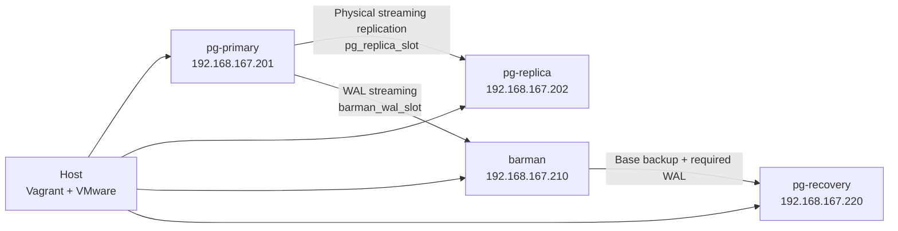

# PostgreSQL Backup & Recovery

Production-like PostgreSQL lab for practicing and demonstrating physical streaming replication, Barman backups, WAL streaming, backup verification, and point-in-time recovery (PITR).

The environment is reproducible with Vagrant and VMware Workstation and uses four Ubuntu 24.04 virtual machines.

## What this project demonstrates

- PostgreSQL 16 primary/standby physical streaming replication
- Dedicated physical replication slots for the standby and Barman
- Barman 3.10 streaming WAL archiving
- Base backups with `barman backup --wait`
- Backup integrity verification with `barman verify-backup` / `pg_verifybackup`
- A reproducible data-loss incident
- PITR to a timestamp before the destructive transaction
- Recovery on an isolated recovery node
- Post-recovery validation and promotion
- Idempotent infrastructure provisioning and host-side operational scripts
- Infrastructure smoke tests

## Architecture



| Node | Purpose | IP |
| --- | --- | --- |
| `pg-primary` | PostgreSQL 16 primary | `192.168.167.201` |
| `pg-replica` | Asynchronous physical standby | `192.168.167.202` |
| `barman` | Backup server and WAL receiver | `192.168.167.210` |
| `pg-recovery` | Isolated PITR target | `192.168.167.220` |

Each VM is configured with 2 vCPU and 2 GB RAM.

See [docs/architecture.md](docs/architecture.md) for details.

## Tested environment

The full end-to-end workflow has been validated on:

- Windows host
- Vagrant `2.4.9`
- VMware Workstation Pro `17`
- Ubuntu `24.04` guests
- PostgreSQL `16.15`
- Barman `3.10.0`
- VMware host-only network `192.168.167.0/24`

PowerShell workflows are validated end to end.

Equivalent Bash host scripts are included for Linux/macOS, but they have **not yet been validated end to end on a native Linux/macOS host**. WSL is not currently a tested/supported host for this lab.

## Prerequisites

On the host:

- Git
- Vagrant
- VMware Workstation/Fusion with a working Vagrant VMware provider
- PowerShell on Windows, or Bash on Linux/macOS
- A VMware host-only network compatible with `192.168.167.0/24`

The current `Vagrantfile` expects these static guest IPs:

```text
192.168.167.201  pg-primary
192.168.167.202  pg-replica
192.168.167.210  barman
192.168.167.220  pg-recovery
```

## Secrets

Provisioning requires three environment variables. Do not commit real passwords.

### Windows PowerShell

```powershell
$env:PG_REPLICATION_PASSWORD = "change-me-replication"
$env:BARMAN_PASSWORD = "change-me-barman"
$env:BARMAN_STREAMING_PASSWORD = "change-me-barman-streaming"
```

### Linux/macOS

```bash
export PG_REPLICATION_PASSWORD="change-me-replication"
export BARMAN_PASSWORD="change-me-barman"
export BARMAN_STREAMING_PASSWORD="change-me-barman-streaming"
```

## Quick start

Clone the repository, set the required environment variables, then create all four VMs:

```powershell
vagrant up
```

Verify the provisioned infrastructure:

```powershell
.\tests\smoke-test.ps1
```

On Linux/macOS, the corresponding command is:

```bash
./tests/smoke-test.sh
```

The smoke test validates the infrastructure baseline: VM reachability, primary/standby roles, streaming replication, physical replication slots, Barman connectivity/WAL receiver, and the recovery-node state. It does **not** require an existing backup or completed PITR incident.

## Full PITR demonstration

Run the workflow from the host. Users do not need to SSH into the VMs manually.

### Windows — validated workflow

```powershell
.\scripts\setup-demo.ps1
.\scripts\backup.ps1
.\scripts\verify-backup.ps1
.\scripts\simulate-data-loss.ps1
.\tests\smoke-test.ps1
.\scripts\recovery-pitr.ps1
.\scripts\verify-recovery.ps1
.\tests\smoke-test.ps1
```

### Linux/macOS — equivalent Bash workflow

```bash
./scripts/setup-demo.sh
./scripts/backup.sh
./scripts/verify-backup.sh
./scripts/simulate-data-loss.sh
./tests/smoke-test.sh
./scripts/recovery-pitr.sh
./scripts/verify-recovery.sh
./tests/smoke-test.sh
```

The Bash workflow mirrors the PowerShell workflow but is currently unverified end to end on a native Linux/macOS host.

## Incident scenario

The demo creates a `recovery_demo` database and inserts three deterministic rows:

| id | customer | amount |
| ---: | --- | ---: |
| 1 | Alice | 125.50 |
| 2 | Bob | 890.00 |
| 3 | Charlie | 42.75 |

The data-loss script records a recovery target and then executes:

```sql
DELETE FROM customer_orders;
```

The PITR workflow restores the latest usable Barman backup from before the target, replays WAL to the recorded timestamp, pauses at the recovery target, verifies that all three rows are present, resumes recovery, and confirms that the recovered instance is writable.

See [docs/recovery-runbook.md](docs/recovery-runbook.md).

## Backup behavior

Barman uses:

- `backup_method = postgres`
- `streaming_archiver = on`
- replication slot `barman_wal_slot`
- `path_prefix = /usr/lib/postgresql/16/bin`
- `retention_policy = REDUNDANCY 2`

The primary standby uses the independent physical slot `pg_replica_slot`.

See [docs/backup-strategy.md](docs/backup-strategy.md).

## Verification

There are three different verification layers:

1. `tests/smoke-test.*` validates infrastructure health.
2. `scripts/verify-backup.*` validates the latest Barman backup and runs `pg_verifybackup`.
3. `scripts/verify-recovery.*` validates the recovered database, expected data, completed recovery state, and write capability.

This separation keeps baseline infrastructure checks independent from the incident/PITR lifecycle.

## Repository layout

```text
.
├── Vagrantfile
├── provision/
│   ├── common.sh
│   ├── primary.sh
│   ├── replica.sh
│   ├── barman.sh
│   └── recovery.sh
├── scripts/
│   ├── setup-demo.ps1
│   ├── setup-demo.sh
│   ├── backup.ps1
│   ├── backup.sh
│   ├── verify-backup.ps1
│   ├── verify-backup.sh
│   ├── simulate-data-loss.ps1
│   ├── simulate-data-loss.sh
│   ├── recovery-pitr.ps1
│   ├── recovery-pitr.sh
│   ├── verify-recovery.ps1
│   └── verify-recovery.sh
├── tests/
│   ├── smoke-test.ps1
│   └── smoke-test.sh
└── docs/
    ├── architecture.md
    ├── backup-strategy.md
    ├── failure-scenarios.md
    └── recovery-runbook.md
```

`provision/` is Vagrant-facing. `scripts/` and `tests/` are host-facing.

## Known limitation

On Ubuntu/Debian packaging, PostgreSQL configuration files such as `postgresql.conf`, `pg_hba.conf`, and `pg_ident.conf` live outside `PGDATA`. `pg_basebackup` therefore does not include them in the base backup. The recovery node already has PostgreSQL installed and its package-managed configuration remains available, but configuration-file backup should be handled separately in a real production design.

## Documentation

- [Architecture](docs/architecture.md)
- [Backup strategy](docs/backup-strategy.md)
- [Recovery runbook](docs/recovery-runbook.md)
- [Failure scenarios](docs/failure-scenarios.md)

## License

See [LICENSE](LICENSE).
