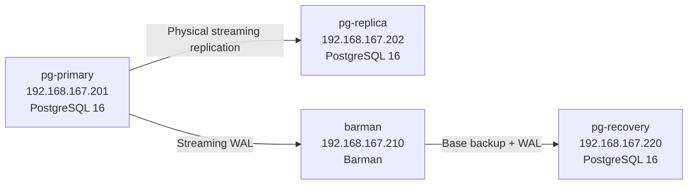

# Architecture

## Overview

This lab separates primary database service, physical standby replication, backup storage, and recovery testing across four Ubuntu 24.04 virtual machines.



The Vagrant host orchestrates lifecycle and operations. Users run operational scripts from the host rather than logging into individual VMs.

## Nodes

### `pg-primary`

Primary PostgreSQL server.

Important settings managed by provisioning include:

```conf
listen_addresses = '*'
wal_level = replica
max_wal_senders = 10
max_replication_slots = 10
wal_keep_size = 512MB
password_encryption = 'scram-sha-256'
```

Provisioning creates:

- `replicator` — physical standby replication user
- `barman` — Barman management/monitoring user
- `barman_streaming` — WAL streaming user
- `pg_replica_slot` — physical replication slot for the standby

### `pg-replica`

Asynchronous physical standby.

On first initialization, provisioning waits for the primary, stops the package-created local cluster, replaces `PGDATA`, runs `pg_basebackup`, uses `-R` to generate standby configuration, uses `pg_replica_slot`, and verifies `pg_is_in_recovery() = true`.

Re-provisioning detects the existing `standby.signal` and skips the destructive base-backup step.

### `barman`

Dedicated Barman host.

Barman connects to the primary through two separate PostgreSQL users:

```text
barman            -> management / backup functions
barman_streaming  -> WAL streaming
```

Relevant configuration:

```ini
backup_method = postgres
streaming_archiver = on
slot_name = barman_wal_slot
create_slot = auto
path_prefix = /usr/lib/postgresql/16/bin
retention_policy = REDUNDANCY 2
```

### `pg-recovery`

Isolated recovery target. PostgreSQL is installed during provisioning, but this node exists specifically for restore/PITR exercises.

## Networking

The lab uses the VMware host-only/private network `192.168.167.0/24`:

```text
192.168.167.201  pg-primary
192.168.167.202  pg-replica
192.168.167.210  barman
192.168.167.220  pg-recovery
```

`provision/common.sh` maintains these mappings in `/etc/hosts` and sets the timezone to `Asia/Tashkent`.

## Replication paths

Two independent streaming consumers connect to the primary:

```text
pg-replica
  user: replicator
  application: 16/main
  slot: pg_replica_slot

barman
  user: barman_streaming
  application: barman_receive_wal
  slot: barman_wal_slot
```

Keeping separate slots means standby retention and backup/WAL retention responsibilities are independent.

## Host orchestration

```text
provision/   Vagrant invokes these inside guests
scripts/     user invokes these from the host
tests/       user invokes these from the host
```

This keeps the user-facing workflow consistent and avoids requiring manual SSH into specific VMs.

## Recovery data flow

```text
Barman base backup
       +
required WAL
       |
       v
pg-recovery PGDATA
       |
       v
replay to .recovery-target
       |
       v
pause -> verify rows -> resume -> writable instance
```

## Platform status

The full workflow has been validated on Windows with Vagrant 2.4.9 and VMware Workstation Pro 17.

Bash equivalents exist for Linux/macOS host orchestration, but native Linux/macOS end-to-end validation is still pending.
